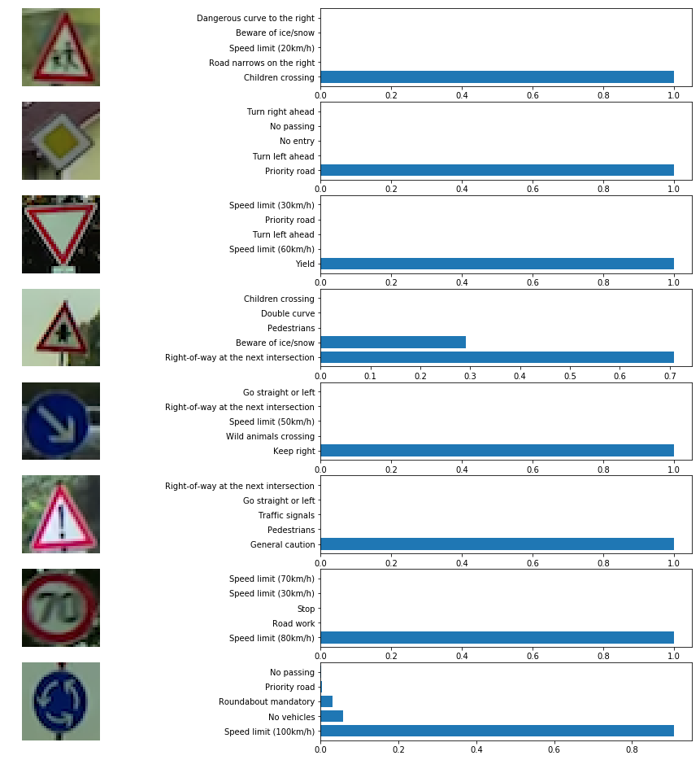

# **Traffic signs classiffication** 

This project contains Traffic Signs Classifier lab. To implement this project I used LeNet architecture. This solution is implemented with usage of TensorFlow framework. Please look into notebook or its html version for implementation and other details.

# Look at the data
It is important to understand if there is enough train images for a sign in case of bad model performance. First of all I look into train dataset to understand distribution of train images and detect then if they are not enough.

Second I look on images more directly to understand what patterns could be applied as preprocession step.

In readme only part of traffic signs is presented, please check notebook or its html version for all traffic sign images.

# Images preprocessing
After images preview we can see that they are taken in different conditions (day, night, snow, with and without light reflection). On some images it is even hard to recognise the sign without preprocessing. If we train the model on this images without any preprocessing, model will give us just around 60% accuracy. So, there should be some preprocessing done for them. I tried several methods and came up with following preprocessing strategy:

1. Grayscale images. Intuition says, that color images has more data and model should work better on them, but if I train the model with grayscale images, it performs much better.
2. Some images are too dark, some are too light, so it will help a lot if we perform some lightning normalisation. I decided to stop on histogram equalisation. Images after this steps train model better, but there is still space to improve by applying of different algorithms and noise reduction.
3. General normalisation of the data to have center in 0. This method does not change an image at all, but has significant effect on the training process.

There is also space for image augmentation: image rotating and transformation, but it should be performed in some intelligent way and not for all images — what will improve one image can "kill" another. So, there should be some image preprocessing, for example, recognition of sign shape and transforming it to normal. We can also try to use information of where on the image is the sign and how far is it, so we could know what transformation should be done to make shape normal. So far I did not apply any image augmentation because images in the test dataset are very different and different types of augmentation should be applied to different images.

Also, cropping of the images to sign size could help the network to learn.

Preview images after preprocessing

# Neural Network Implementation

Implement neural network based on the [LeNet-5](http://yann.lecun.com/exdb/lenet/) neural network architecture.

### Input
The LeNet architecture accepts a 32x32xC image as input, where C is the number of color channels (1 in my case because of grayscaling). 

### Architecture
* **Layer 1: Convolutional.** Input = 32x32x1. Output = 28x28x43.
* **Activation.** Relu function.
* **Pooling.** The output shape should be 14x14x43.
* 
* **Layer 2: Convolutional.** Input = 14x14x43. Output = 10x10x80.
* **Activation.** Relu function.
* **Pooling.** The output shape should be 5x5x80.
* 
* **Layer 3: Convolutional.** Input = 5x5x80. Output = 3x3x200.
* **Activation.** Relu function.
* **Pooling.** The output shape should be 2x2x200.
* 
* **Flatten.** Flatten the output shape of the final pooling layer. Output = 1x800
* 
* **Layer 4: Fully Connected.** Input = 800. Output = 120.
* **Activation.** Your choice of activation function.
* 
* **Layer 5: Fully Connected.** Input = 120. Output = 84.
* **Activation.** Your choice of activation function.
* 
* **Layer 6: Fully Connected (Logits).** Input = 84. Output = 43

## Training Pipeline
For training pipeline I used 50 epochs and 128 batch size. Incresing of batch size to 256 did not change accuracy of the model, so I decided to stop on this value. I have also trained model with 35 epochs, but after 30 epochs accuracy is normally more or less the same.

I took relu function for activation.

I took Adam optimizer as optimizer.

The first architecture I used was basic LeNet implementation: it contained 2 convolutional layels and gave me around 86% accuracy. Encreasing its convolutional layels to 3 and changing of size of each level encreased accuracy to around 92%. Increasing to 4 levels did not chage accuracy and I decided to remove 4th level.

I tuned a lot parameters of layels, for example input and output shapes, and came with parameters which satisfy me the best.

I also tried to take average pooling instead of max pooling in my model. I did not see significant effect on the results. This version of notebook contains max pooling.

I also added dropout on non convolutional layels with keep probbablility of 0,7. It decreased accuracy a bit on validation and test sets, but increased accuracy on my images. Current version of notebook contains version without dropout.

## Evaluate the Model
Next I evaluate the performance of the model on the test set.

Test Accuracy = 0.956

# Results analysis

I was able to reach around 98% accuracy on the validation set. It shows 95.6% accuracy on test set. It is not the best results and for sure not safe for production usage, so gives a room for improvements (I would suggest to stop near 99.99%). Improvements could be done in 3 basic places:
1. Model. I played with different amount of network layers, sizes, epoch. In general if we increase amount of epochs changing of other parameters reflects only on how fast network learns, end accuracy does not change significantly. I ended up with an architecture which gives me good results in some suitable time.
2. Images preprocessing. I think this is the place where improvements could be done. My general proposal for improvements would be better image lightning normalisation and image transformation (see image preprocessing section for details on this proposals).
3. Extending of training set.
4. Ectending training set by applying transformation for train image: change perspective and lighning, because they may appear in different parts of the road with different angle.

In order to see how I can improve the accuracy I need to analyse more detaily where the pipeline performs good and where not. 

# Observations

We see that some signs has bad accuracy in recognition. For some of them it is dangerous, for example, "Pedestrians".
Possible solutions how to fix that:
1. Extend train set with this signs.
2. Train model for longer time.
3. If previous did not help, see top 5 softmax probabilities for them, check what are top wrong predictions and try to observe what could be done on preprocessing stage to help neural network distinguish this signs from the top wrong.

One more interesting observation is that there is no correlation between amount of images in the train dataset and accuracy. This may be because some of images are just easier to detect and another are harder.

# Run algorythm on my images
I took images from video with driving in Germany and resized them to 32x32. Name of the image represents sign (for evaluation).

### Load and preprocess images

Preprocessed: 

### Evaluate model on my images

My images recognition accuracy = 0.750

### Visualise top 5 softmax probabilities for my images

### Summary for my images

For my images taken from German Driving video model performs not very good. There are three signs with bad recognition results: 
1. Rign of way at the next intersecrtion gives correct recognition, but only 0.7 probability
2. Speed limit for 70 km/h is recognised as 80 km/h with 100% probability! That is very surprising and is related to the fact that traffic sign is cropped. Once I make it inside the image my model gives better results. It means, that model is sensitive to correct cropping and should be extended with cropped images (or we need to ensure that images will be always correct cropped).
3. Roundabout mandatory is recognied as speed limit 100 km/h. Looking at perocessing image of this and Rign of way at the next intersecrtion sign I see that after preprocessing there is ligt border around the sign. Another signs does not have it. So maybe, it is related to wrong recognition and should be analysed. 
