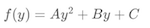
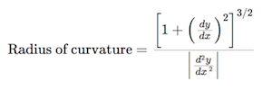

## Advanced Lane Finding

# Advance lane lines detection project

The goal of this project is to detect lane lines on the image taken from car front camera. For implementation details and more images please check Jupyter notebook or its html version in this repo. Code in html and notebook is located under same parts as here, so you can easily find any code there.

Steps of this project are the following:
1. Compute the camera calibration matrix and distortion coefficients given a set of chessboard images. Apply a distortion correction to raw images.
2. Apply a perspective transform to rectify binary image ("birds-eye view").
3. Use color transforms, gradients, etc., to create a thresholded binary image.
4. Detect lane pixels and fit to find the lane boundary.
5. Determine the curvature of the lane and vehicle position with respect to center.
6. Warp the detected lane boundaries back onto the original image.
7. Output visual display of the lane boundaries and numerical estimation of lane curvature and vehicle position.

## Image undistortion
As the first step of the image processing pipeline we need to undistort the image to remove camera distortion.

### 1. Calibrate camera
First of all, we need to calibrate the camera basing on images of the chess board taken on the flat surface. We will calculate image and object points - coordinates of inner corners of the chess board on the image and normalized coordinates.

I start by preparing "object points", which will be the (x, y, z) coordinates of the chessboard corners in the world. Here I am assuming the chessboard is fixed on the (x, y) plane at z=0, such that the object points are the same for each calibration image. Thus, `objp` is just a replicated array of coordinates, and `objpoints` will be appended with a copy of it every time I successfully detect all chessboard corners in a test image. `imgpoints` will be appended with the (x, y) pixel position of each of the corners in the image plane with each successful chessboard detection.

I then used the output `objpoints` and `imgpoints` to compute the camera calibration and distortion coefficients using the cv2.calibrateCamera() function.

Undistortion of the chess board:

Undistortion of the image taken from front camera:

## Bird-eye transformation
As the next step I want to apply image perspective transformation to make "bird eye" view. In this case lane lines become parallel and it would be easier to calculate shape of lane lines. 

In order to perform this transformation I took one photo from the front camera where lines are parallel and calculated the coefficients for image transformation by taking coordinates of the left and right line near the car and on some distance. Probably this method will work only on flat surface and not work on hills, so for smarter solution we need smth more advanced. 

During this transofrmation I also change size of the image to make it vertical so it will be easier for my pipeline to detect lane lines. If I keep origin size, line became much shorter and it is easier to fail their detection.

## Thresholding
As the next step I apply different techniques to get a thresholded image where white pixels will represent lane lines and black will be all the rest.

### 1. Apply Sobel operator
The Sobel operator is the heart of the Canny edge detection algorithm. As soon as I apply it to warped "bird-eye" view image where my lane lines are located vertically, I can take gradients only in x direction.

To apply Sobel operator I convert the image to HLS space and apply it to lightness channel. I tried to apply it to other channels and apply to grayscaled image, but this approach gives more robust results.

### 2. Apply color thresholding
After applying Sobel operator I miss lane lines on some part of the road, where lighting of the surface is hight. To fix it I convert the image to HLS space and apply color thresholding to saturation channel. 

### 3. Clean noize
Some objects on the image could be concidered as not lane lines even now. I remove all white horisontal lines that are longer than width of lane line.

When I compare all the images I see that combination of saturation thresholded channel and lightness channel with edge detection gives me almost whole lane lines in most of the cases. 

On images we can see from left to right: original warped image, hue channel with Sobel operator, lightness channel with Sobel operator, saturation channel with Sobel operator, saturation channel with threshold applied, saturation thresholded channel with clean noize applied

### 4. Combine all together
Now I can combine all thresholded images and apply noize reduction

## Lane lines detection
As soon as I have thresholded image with lane lines on it, I can detect them. As the result I return coefficients `A`, `B` and `C` of the curve function .

To do it I:
1. Take histogram and clean center, left and right areas (make them equal 0). I do it because at this project car expected to be in the center of the lane, so I can predict bottom closest to the car position of lane lines as circa 1/6 on the left and 5/6 on the right of the image.
2. Take a histogram and detect all maximums that are > than some threshold. When I take max value I clean area around with small radius because probably it belongs to same line.
3. Get all peaks from left and right halмes of the image and find two where distance between them is closer to expected lane width. It helps me to rid out of fake predisctions where surface of the road changes and histogram peak is stronger than lane peak.
4.  I can use that as a starting point for where to search for the lines. From that point, I use a sliding window, placed around the line centers, to find and follow the lines up to the top of the frame.

Calculated lines on the image and used histogram:

### Apply on the real images
I can apply my pipeline to images from camera now

## Calculate radius of curvative
Now I have A, B and C coefficients of  formula. To calculate radius of curvative of abstract function I can use following formula: 

. 

For my f(y) formula this should be:

.

## Process video

For vdeo processing I use two tricks:

1. Skip sliding windows. If lane line was detected, I can reuse this knowledge for the next image to faster and more robust search.
2. Define Lane class that will help to average lane lines on video by keeping last x lines. I use weighted average, where I don't change average if new left or right line is very different from previous. This helps me to be more stable in case of detection bugs or small jumps of the car.

## Discussion

My pipeline works good on provided videos, but there is still room for improvements.

First and main should be sanity checks for found lane lines. So far I do not perform any sanity checks, only on first search some histogram tricks like removing of borders and center and defining peaks with expected distance. Ideally on each step I should detect if lines are still parallel and size between the lines is same and if not, then fall down into histogram search again.

Second, ideally I should detect all lines on the image and predict which two are most likely lane lines. 

Also, So far I use sliding window search only on the first image and then reuse found lane. It means, if my first line was detected wrongly, all following lines will be wrong as well. For project videos it's not a problem, but I need to perform sanity checks after each line dectection and if it fails, then do search one more time using sliding window.

My pipeline still works not good when only one lane line is visible on strong curves. A soon as goal is to detect radius of curvative, probably it is enought to calculate radius by one line. 

Problems also appears on hilly areas, where my bird-eye transformation gives not parallel lines.

One more thing is the fact that lane lines can have different curvative radius in short period. Probably it makes sence to imrove sliding window functions to detect more complicated f(y) functions.

