# Vehicle detection project
[](http://www.udacity.com/drive)

Steps of this project are the following:
* Perform a Histogram of Oriented Gradients (HOG) feature extraction on a labeled training set of images and train a classifier Linear SVM classifier
* Apply a color transform and append binned color features, as well as histograms of color, to HOG feature vector. 
* Implement a sliding-window technique and use trained classifier to search for vehicles in images.
* Create a heat map of recurring detections to reject outliers and follow detected vehicles.
* Estimate a bounding box for vehicles detected.

Please find all the code in Jupyter Notebook. The code is splitted in the same sections as this writeup and could be easily found under similar sections.

# Research
First of all I need to define and train my model. In order to do it I need:
1. Select a model (I used support vector machines classifier).
2. Define features, that will be extracted from the images.
3. Train the model on defined features and test it.
4. Find best parameters for the model and feature extraction.

### Prepare data 
First of all, I took training data. I used provided in course set of vehicle and non vehicle images. Lets look on its size and quality.

Vehicle images:      8792
Non vehicle images:  8968

Vehicles:
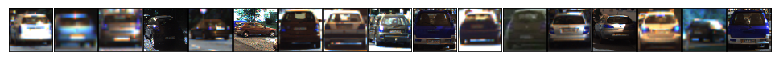
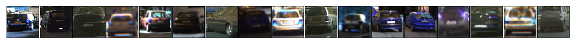


Non vehicles: 

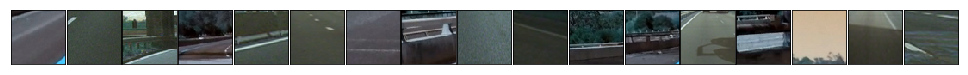
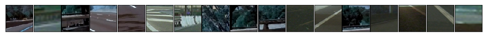

Dataset looks not so big, but may be enough for good classification. I could also apply image augmentation to improve quality of the model. Amount of non car images is almost equal to amount of car images, so I do not need to balance my train dataset.

### HOG
As the next step I want to define features that I want to extract. First will be converting of the image to histogram of oriented gradients (HOG). In another words I want to extract HOG features.
In HOG I can define following parameters:
* amount of orientations
* pixels per cell
* cells per block

For first parameter I used value 13. For second and third I need to perform some research. First of all, lets take a look on how HOG features looks like for valies 8 and 8, 4 and 16, 2 and 32, 16 and 4, 32 and 2.


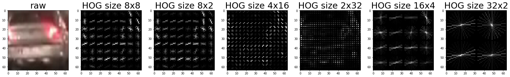

Images with parameters (pixels per cell, cells per block) = (8,8), (4,16) and (2,32) looks mode precise from human point of view. (16,4) and (32, 2) looks too general from first perspective (but may be also good for detection). Images (8,8) gives good vision of the shape of the car, (4,16) and (2,32) gives more car details like car registration number bar and windows.
What will be the best one? Probably, I should not select only one and can concatenate all three features. It may have sense because when we see objects with our eyes, we first extract shape of the object, similar to what we could see on image with parameters (8,8) and then look into details, that we could get from the images (4,16) and (2,32). But let the model define for us. I trained the classifier with different set of hog parameters and found that combination of (8,8) and (4,16) gives me the most robust results, but it was too slow and I decided to use just (8,8). I will stop on this moment later.

#### Define color channel for HOG

In the previous example I applied HOG transformation to blue channel of RGB version of the image. But it makes sence to find channels that will give more accurate feature exctraction. Lets see how different channels looks like for train images and what happens when we apply HOG to them.


    cspace: RGB, channel: 0


    cspace: RGB, channel: 1


    cspace: RGB, channel: 2


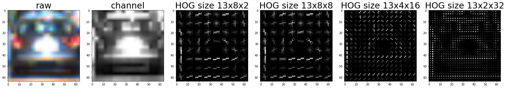


    cspace: HSV, channel: 0


    cspace: HSV, channel: 1


    cspace: HSV, channel: 2


    cspace: LUV, channel: 0


    cspace: LUV, channel: 1


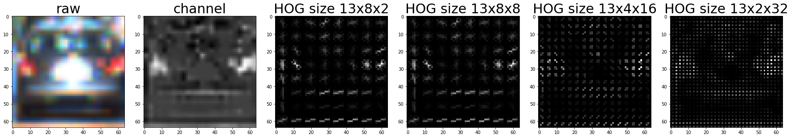


    cspace: LUV, channel: 2


    cspace: HLS, channel: 0


    cspace: HLS, channel: 1


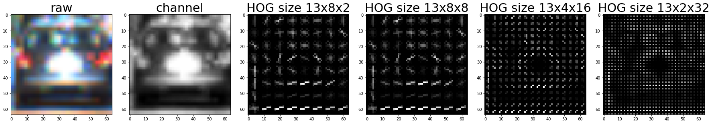


    cspace: HLS, channel: 2


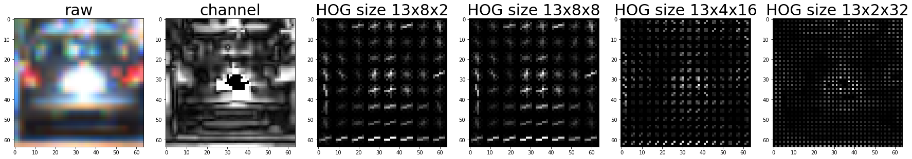


    cspace: YUV, channel: 0


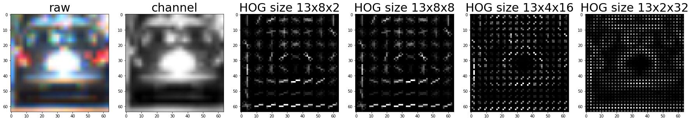


    cspace: YUV, channel: 1


    cspace: YUV, channel: 2


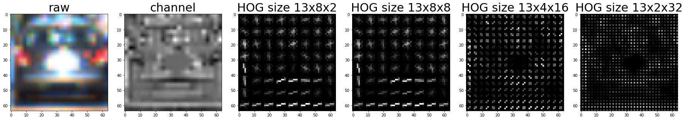


    cspace: YCrCb, channel: 0


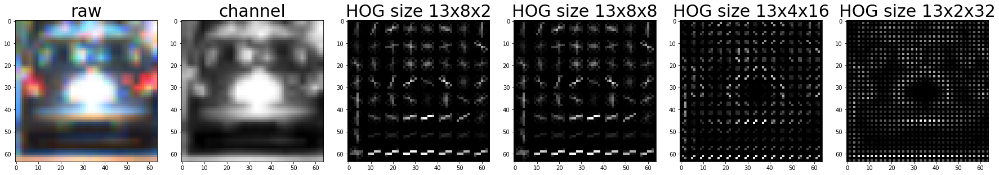


    cspace: YCrCb, channel: 1


    cspace: YCrCb, channel: 2


We can clearly see that on some channels car image is better recognisable and on some worse. But this recognition is made by human, what will our classifier say about it? Lets give it a try!

### More features

I also defined a function to compute binned color features and a function to compute color histogram features. I want to see if this features will help me with my model. I did not use it in my pipeline.


### Test the model!

So, now we can test classifier in different colour spaces, with different HOG parameters and with different set of features.

```    
Test accuracy for SVC with HOG 0 in Color Space RGB =  0.9135
Test accuracy for SVC with HOG 1 in Color Space RGB =  0.9195
Test accuracy for SVC with HOG 2 in Color Space RGB =  0.9222
Test accuracy for SVC with HOG ALL in Color Space RGB =  0.9342
Test accuracy for SVC with HOG 0 in Color Space HSV =  0.8803
Test accuracy for SVC with HOG 1 in Color Space HSV =  0.8435
Test accuracy for SVC with HOG 2 in Color Space HSV =  0.92
Test accuracy for SVC with HOG ALL in Color Space HSV =  0.955
Test accuracy for SVC with HOG 0 in Color Space LUV =  0.9168
Test accuracy for SVC with HOG 1 in Color Space LUV =  0.8902
Test accuracy for SVC with HOG 2 in Color Space LUV =  0.8675
Test accuracy for SVC with HOG ALL in Color Space LUV =  0.944
Test accuracy for SVC with HOG 0 in Color Space HLS =  0.8812
Test accuracy for SVC with HOG 1 in Color Space HLS =  0.917
Test accuracy for SVC with HOG 2 in Color Space HLS =  0.834
Test accuracy for SVC with HOG ALL in Color Space HLS =  0.95
Test accuracy for SVC with HOG 0 in Color Space YUV =  0.9188
Test accuracy for SVC with HOG 1 in Color Space YUV =  0.898
Test accuracy for SVC with HOG 2 in Color Space YUV =  0.8823
Test accuracy for SVC with HOG ALL in Color Space YUV =  0.9544
Test accuracy for SVC with HOG 0 in Color Space YCrCb =  0.9158
Test accuracy for SVC with HOG 1 in Color Space YCrCb =  0.897
Test accuracy for SVC with HOG 2 in Color Space YCrCb =  0.8815
Test accuracy for SVC with HOG ALL in Color Space YCrCb =  0.9527
```

```
Test accuracy for SVC with C 1 =  0.9398
Test accuracy for SVC with C 6 =  0.9597
Test accuracy for SVC with C 11 =  0.9637
Test accuracy for SVC with C 16 =  0.9662
Test accuracy for SVC with C 21 =  0.968
Test accuracy for SVC with C 26 =  0.9687
Test accuracy for SVC with C 31 =  0.97
Test accuracy for SVC with C 36 =  0.9708
Test accuracy for SVC with C 41 =  0.9714
Test accuracy for SVC with C 46 =  0.972
Test accuracy for SVC with C 51 =  0.9723
Test accuracy for SVC with C 56 =  0.9722
Test accuracy for SVC with C 61 =  0.9727
Test accuracy for SVC with C 66 =  0.973
Test accuracy for SVC with C 71 =  0.9731
Test accuracy for SVC with C 76 =  0.9732
Test accuracy for SVC with C 81 =  0.9738
Test accuracy for SVC with C 86 =  0.9739
Test accuracy for SVC with C 91 =  0.9739
Test accuracy for SVC with C 96 =  0.974
```

After numerous amount of runs with different parameters I got best results with following parameters:
1. use only HOG features
2. do in YCrCb color space with all channels
3. use (8,8) + (4,16) HOG parameters
4. parameter C of SupportSVC function around 50

So now I can start with building of my pipeline. During building the pipeline I discovered that proposed combination of HOG parameters gives me a bit better results than (8,8), but is much slower, so I tuned it to use only (8,8).

# Pipeline
### 1. Train classifier 
Train classifier. Use LinearSVC from sklearn. I applied StandardScaler method from sklearn to normalize features.

### 2. Implement sliding window
In order to detect car on the image I implement sliding window function that takes image, size of the window border in pixels, step overlay (step size is window width divided by step overlay), y thresholds (so for smaller windows I can search more in center of the image, when for bigger search in bigger area). I use all width of the image, so I do not need any x thresholds.

### 3. Define clas for keeping predictions
Define class for keeping rectangles with predicted images. I use it during video processing to reduce amount of false positives. 

### 4. Get positions of the car on the image
Then I defined main functions to get positions of the car on the image. It contains following steps:
1. Apply general y thresholds for faster work. All following thresholds will be applied inside cropped image.
2. Convert image to YCrCb color space.
3. Call window functions for all channels with several sizes. I used 6 sizes with different y thresholds and step overlays (look into the code for details).
4. Apply y offset to all found rectangles, so I get correct y values for non cropped image.
5. Add found rectangles to stack (to average over several video frames and filter out false positives)
6. Create heatmap from stack of rectangles
7. Calculate labels from heatmap and draw all that has > than X (I used 50 - 60) intersects of different rectangles in order to exclude false positives.


### 4. Run on test images


On test images it looks not so bad. The model gives lots of false positives, but I filter them out on the heatmap. It's time to apply it on video pipeline!


# Summary

My pipeline is able to detect cars on given images, but it still could be improved:
1. First of all, quality of the model should be improved. Current model gives lots of false positives and probably I should use different model (not support vector machines), or extend train dataset, or use different features from the image to detect. I was able to filter out false positive results on video by stacking of the rectangles, but it may also filter out real car if it will suddenly apply on the image and will move too fast.
2. Second, speed of recognition could be improved. I think sliding window function could be called on less amount of places and sizes, and probably features vector could be optimized as well. 
3. It's not about the model itself, but this code could be refactored and simplified. I was focused more on the results and did not put too much attention on code clearnes.

My pipeline will probably fail in night and dark conditions, it may fail even in a tonnel. 
From my perspective vehicle detection should be done on sensor level — it will be probably faster, more robust and safer.